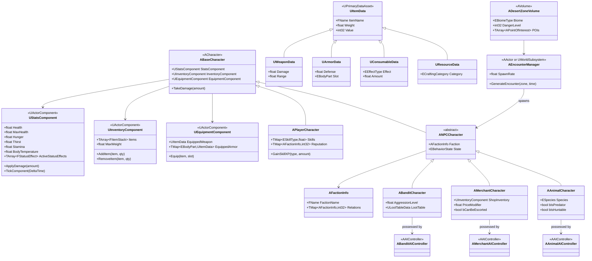
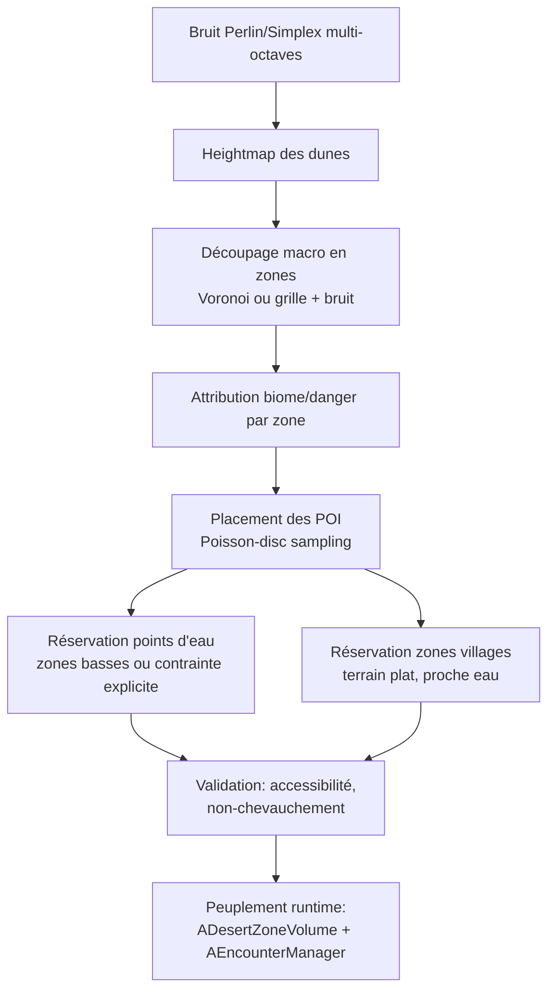

# Cahier des besoins — Jeu Sandbox Désert (inspiré de Kenshi)
### Moteur : Unreal Engine

## 1. Concept

Jeu de survie sandbox en monde ouvert désertique, **centré sur un seul personnage** (contrairement à Kenshi, pas de gestion d'escouade/base). L'accent est mis sur la **liberté du joueur** : pas de scénario linéaire imposé, le joueur choisit son style de jeu (combattant, marchand itinérant, chasseur, pillard, ermite...) et progresse par ses actions.

## 2. Décisions actées

| Sujet | Décision |
|---|---|
| Moteur | **Unreal Engine** (UE5) |
| Système de dégâts | **Score de vie classique** (pas de dégâts localisés par membre) |
| Premier chantier | **Carte procédurale désertique** (dunes + zones réservées pour points d'intérêt) |

---

## 3. Besoins fonctionnels

### A. Survie
- Jauges de faim, soif, fatigue, température corporelle
- Chaleur le jour (risque de coup de chaleur), froid la nuit
- Nécessité de trouver eau, nourriture, ombre/abri
- Blessures et états négatifs (déshydratation, infection, épuisement)
- Sommeil / repos pour récupérer stamina et soigner

### B. Exploration
- Monde désertique (dunes, oasis, canyons rocheux, ruines) — génération procédurale
- Cycle jour/nuit influant sur température, visibilité et rencontres
- Météo dynamique (tempêtes de sable réduisant la visibilité et augmentant le danger)
- Points d'intérêt : villages (futurs), campements de bandits, ruines, oasis, puits

### C. Rencontres (cœur du gameplay)
- **Bandits** : embuscades, groupes, butin à la clé
- **Animaux** : certains hostiles/prédateurs, certains chassables (ressources), éventuellement apprivoisables/montables
- **Marchands** : caravanes itinérantes, achat/vente, possibilité de les escorter contre rémunération ou de les attaquer
- Génération des rencontres selon la zone, l'heure et le niveau de danger

### D. Combat
- Corps à corps et/ou à distance (arc, armes de jet)
- Score de vie unique, dégâts modulés par armure/résistances (pas de localisation par membre)
- Fuite et discrétion comme alternatives valables au combat frontal

### E. Économie / Inventaire
- Inventaire avec poids/encombrement
- Équipement : armes, armures, vêtements adaptés au désert (protection chaleur/froid)
- Craft basique : réparation, fabrication d'objets de survie
- Commerce avec les marchands, prix variables selon réputation/rareté

### F. Progression
- Pas de classes figées : compétences qui progressent par la pratique (façon Kenshi/Skyrim)
- Réputation avec les factions (bandits, marchands, villages)

### G. Intelligence artificielle
- Animaux : fuite, chasse, comportement territorial ou de meute
- Bandits : patrouille, embuscade, poursuite, retraite si en infériorité
- Marchands : déplacement entre points, fuite ou appel à l'aide si menacés

---

## 4. Besoins non-fonctionnels
- Moteur : Unreal Engine 5
- Plateforme cible : PC en priorité
- Monde ouvert : **World Partition** pour le streaming de zones à grande échelle
- Système de sauvegarde (état du monde + du joueur)

---

## 5. Proposition de périmètre MVP

1. Carte procédurale désertique avec zones réservées (POI futurs, points d'eau)
2. Un personnage jouable avec faim/soif/santé
3. Un type de rencontre : bandits (combat + fuite)
4. Un type de rencontre : animal chassable
5. Inventaire simple + une arme + un objet de soin
6. Cycle jour/nuit basique

Les marchands, le craft, la réputation et la météo dynamique peuvent arriver en itération 2.

---

## 6. Diagramme de classes (adapté aux conventions Unreal)

Unreal privilégie la **composition** (ActorComponent) à l'héritage profond. Les stats de survie, l'inventaire et l'équipement deviennent des composants réutilisables entre le joueur et les PNJ, plutôt qu'une chaîne d'héritage rigide.

### Notes
- `UStatsComponent`, `UInventoryComponent`, `UEquipmentComponent` sont attachés à **tout** `ABaseCharacter` (joueur et PNJ) : évite la duplication de logique.
- Les items (`UItemData` et dérivés) sont modélisés en **Primary Data Assets**, l'approche standard Unreal pour des données de jeu éditables sans recompiler.
- Chaque type de PNJ a son propre `AAIController` (Behavior Trees + Blackboard, natifs à Unreal) plutôt qu'une classe IA maison.
- `ADesertZoneVolume` peut être une `AVolume` placée par la génération procédurale, portant les métadonnées (biome, danger) et référençant un `AEncounterManager`.

---

## 7. Génération procédurale de la carte désertique

### Pipeline proposé

### Détail des étapes
1. **Heightmap** : bruit de Perlin/Simplex multi-octaves pour la forme des dunes (érosion réaliste = itération 2, pas nécessaire au MVP)
2. **Découpage macro** : diagramme de Voronoi (ou grille bruitée) pour définir des cellules = futures `ADesertZoneVolume`
3. **Biome/danger** : chaque cellule reçoit un type de biome et un niveau de danger (influence la génération de rencontres plus tard)
4. **Placement des POI** : Poisson-disc sampling pour espacer les points d'intérêt (distance minimale garantie entre eux)
5. **Contraintes spécifiques** : les points d'eau sont préférentiellement placés dans les zones basses de la heightmap ; les zones "village" nécessitent un terrain plat proche d'un point d'eau
6. **Validation** : vérifier qu'aucun POI n'est isolé par une dune infranchissable, éviter les chevauchements

### Outils Unreal à mobiliser
- **PCG Framework** (UE5.3+) : très adapté pour le placement scriptable des POI, de la végétation, des rochers selon des règles (idéal pour les étapes 4-5)
- **Landscape** : pour le rendu du terrain final. Point d'attention : Landscape est pensé pour un terrain plutôt "sculpté/authored" — pour du **vraiment procédural en runtime**, deux options : (a) générer la heightmap procéduralement puis l'importer dans un Landscape au chargement, ou (b) utiliser un maillage procédural custom (`ProceduralMeshComponent`) pour un contrôle total en runtime, au prix d'un travail plus lourd (LOD, collisions à gérer soi-même)
- **World Partition** : indispensable dès que la carte devient grande, pour streamer les zones à la volée
- **Data Layers** : utile plus tard pour activer/désactiver du contenu par zone

### Décision : Landscape + heightmap générée par seed

- Terrain basé sur `Landscape`, alimenté par une heightmap générée par bruit (Perlin/Simplex), exportée en 16-bit puis importée
- **LOD géré nativement** : chaque composant Landscape bascule son niveau de détail selon la distance à la caméra, sans code custom
- **World Partition + HLOD** en complément : simplification/fusion des tuiles lointaines et streaming automatique des zones proches du joueur
- Carte reproductible par seed (utile pour du debug, du partage de seed entre joueurs, ou une génération différente à chaque partie selon le choix de design)

---

## 8. Points encore à trancher
- Portée du craft et de l'économie dans le MVP
- Faut-il des animaux montables dès le MVP ou en itération 2 ?
- Import de la heightmap : au chargement (offline, via éditeur) ou génération procédurale au runtime via l'API Landscape ?
